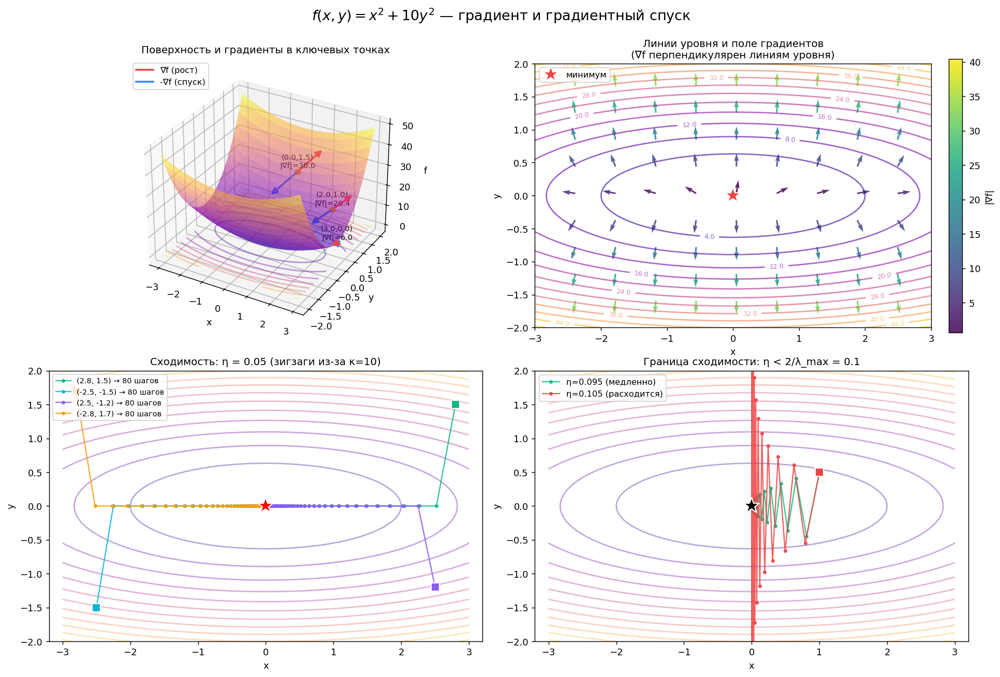

# Градиент и градиентный спуск

Конспект и интерактивная визуализация градиента и градиентного спуска на примере функции $f(x, y) = x^2 + 10y^2$.

**👉 [Открыть интерактивную визуализацию](https://movi2752.github.io/Gradient/gradient_viz_interactive.html)**

[](https://movi2752.github.io/Gradient/gradient_viz_interactive.html)

*Клик по картинке → запустится интерактивная 3D-визуализация: вращай поверхность, двигай слайдер $\eta$, нажимай старт — увидишь анимацию градиентного спуска.*

---

## Содержание

- [1. Градиент](#1-градиент)
- [2. Градиентный спуск](#2-градиентный-спуск)
- [3. Где метод ломается](#3-где-метод-ломается)
- [4. Варианты метода](#4-варианты-метода)
- [5. Код](#5-код)
- [Файлы в репозитории](#файлы-в-репозитории)

---

## TL;DR

> [!NOTE]
> **Градиент** — вектор частных производных. Указывает направление *наискорейшего возрастания* функции; длина равна скорости этого возрастания.
>
> **Градиентный спуск** — итеративный метод поиска минимума: на каждом шаге двигаемся против градиента с шагом $\eta$. Для выпуклых функций сходится к глобальному минимуму.

---

## 1. Градиент

### 1.1 Определение

Для функции $f: \mathbb{R}^n \to \mathbb{R}$ градиент — это вектор из всех частных производных:

$$\nabla f(\mathbf{x}) = \left(\frac{\partial f}{\partial x_1},\ \frac{\partial f}{\partial x_2},\ \ldots,\ \frac{\partial f}{\partial x_n}\right)^\top$$

Обозначения: $\nabla f$, $\text{grad}\\,f$, $\partial f / \partial \mathbf{x}$.

**Пример.** Для $f(x, y) = x^2 + 10y^2$:

$$\nabla f = (2x,\ 20y)$$

| Точка | $\nabla f$ | $\lVert\nabla f\rVert$ |
| ----- | ---------- | -------------- |
| $(3, 0)$ | $(6, 0)$ | $6$ |
| $(0, 1.5)$ | $(0, 30)$ | $30$ |
| $(2, 1)$ | $(4, 20)$ | $\approx 20.4$ |
| $(0, 0)$ | $(0, 0)$ | $0$ |

### 1.2 Геометрический смысл

Градиент в точке $\mathbf{x}_0$ — это вектор, который:

1. **Направлен в сторону наискорейшего возрастания** функции из этой точки.
2. **Длина равна скорости** этого возрастания (производная по направлению градиента максимальна и равна $\lVert\nabla f\rVert$).
3. **Антиградиент** $-\nabla f$ — направление наискорейшего убывания.

> [!IMPORTANT]
> **Где живёт градиент.** Градиент функции $f(x_1, \ldots, x_n)$ — вектор в $\mathbb{R}^n$, в *пространстве аргументов*. Для функции двух переменных он лежит в плоскости $XY$, без компоненты по $Z$. На 3D-графике поверхности стрелки градиента рисуются **горизонтально**.
>
> Не путать с вектором наибольшего наклона поверхности — тот живёт в $\mathbb{R}^3$ и касается поверхности.

### 1.3 Ключевые свойства

**Перпендикулярность линиям уровня.** Градиент в точке $\mathbf{x}_0$ перпендикулярен линии уровня $\\{f = f(\mathbf{x}_0)\\}$, проходящей через эту точку.

*Доказательство.* Если $\gamma(t)$ — параметризация линии уровня, то $f(\gamma(t)) = \text{const}$. Дифференцируя: $\nabla f \cdot \gamma'(t) = 0$, то есть $\nabla f \perp \gamma'(t)$.

**Нуль в экстремумах.** В точках локального минимума и максимума градиент равен нулю:

$$\mathbf{x}^* \text{ — экстремум} \implies \nabla f(\mathbf{x}^*) = \mathbf{0}$$

Обратное **не** верно: $\nabla f = \mathbf{0}$ может означать [седловую точку](#32-седловые-точки).

**Производная по направлению.** Для единичного вектора $\mathbf{u}$:

$$\frac{\partial f}{\partial \mathbf{u}} = \nabla f \cdot \mathbf{u} = \lVert\nabla f\rVert \cos\theta$$

Максимум при $\theta = 0$ (вдоль градиента), минимум при $\theta = \pi$ (против градиента).

### 1.4 Интерактивная визуализация

🚀 **[Запустить в браузере](https://movi2752.github.io/Gradient/gradient_viz_interactive.html)**

В визуализации можно:

- Вращать 3D-поверхность мышкой
- Двигать слайдер $\eta$ (learning rate) от 0.001 до 0.12
- Запускать спуск из 3 разных стартовых точек
- Наблюдать как при $\eta \geq 0.1$ метод расходится

---

## 2. Градиентный спуск

### 2.1 Идея

Ищем минимум функции $f(\mathbf{x})$. Прямое решение системы $\nabla f = \mathbf{0}$ часто невозможно (нелинейные уравнения, большая размерность). Идём итеративно: на каждом шаге делаем маленький шаг в сторону наискорейшего убывания.

### 2.2 Формула

$$\mathbf{x}_{t+1} = \mathbf{x}_t - \eta \nabla f(\mathbf{x}_t)$$

где $\eta > 0$ — **learning rate** (шаг, скорость обучения).

**Почему работает.** Из разложения Тейлора первого порядка:

$$f(\mathbf{x} + \Delta\mathbf{x}) \approx f(\mathbf{x}) + \nabla f(\mathbf{x})^\top \Delta\mathbf{x}$$

Чтобы $f$ уменьшилась, нужно $\nabla f^\top \Delta\mathbf{x} < 0$. Скалярное произведение минимально (наиболее отрицательно), когда $\Delta\mathbf{x}$ антипараллелен градиенту. Отсюда выбор $\Delta\mathbf{x} = -\eta \nabla f$.

### 2.3 Алгоритм

```text
вход: f, ∇f, x₀, η, ε, T_max
для t = 0, 1, 2, ..., T_max:
    g ← ∇f(xₜ)
    если ||g|| < ε: вернуть xₜ
    xₜ₊₁ ← xₜ − η · g
вернуть x_T
```

### 2.4 Сходимость и learning rate

**Слишком маленький $\eta$.** Метод сходится, но медленно — ползём вечность.

**Слишком большой $\eta$.** Перепрыгиваем минимум, осцилляции или расходимость (значения функции улетают в бесконечность).

**Точное условие для квадратичной функции.** Для $f(\mathbf{x}) = \tfrac{1}{2}\mathbf{x}^\top A \mathbf{x}$ с положительно определённой $A$ градиентный спуск сходится тогда и только тогда, когда:

$$0 < \eta < \frac{2}{\lambda_{\max}(A)}$$

где $\lambda_{\max}$ — наибольшее собственное число $A$. Оптимальный шаг:

$$\eta^* = \frac{2}{\lambda_{\max} + \lambda_{\min}}$$

**Пример из визуализации.** Для $f(x,y) = x^2 + 10y^2$ матрица гессиана $A = \text{diag}(2, 20)$, $\lambda_{\max} = 20$, $\lambda_{\min} = 2$.

- Граница сходимости: $\eta < 2/20 = 0.1$
- Оптимальный шаг: $\eta^* = 2/22 \approx 0.091$

При $\eta \geq 0.1$ метод осциллирует по оси $y$ и расходится (можно проверить в интерактиве).

### 2.5 Число обусловленности

$$\kappa = \frac{\lambda_{\max}}{\lambda_{\min}}$$

Чем больше $\kappa$, тем медленнее сходимость. Скорость уменьшения ошибки:

$$ \|\mathbf{x}_t - \mathbf{x}^\*\| \le \left(\frac{\kappa - 1}{\kappa + 1}\right)^t \|\mathbf{x}_0 - \mathbf{x}^\*\| $$

Для функции $x^2 + 10y^2$: $\kappa = 10$, коэффициент $9/11 \approx 0.818$ — медленно. Для $x^2 + y^2$: $\kappa = 1$, коэффициент $0$ — один шаг.

Эта проблема — **плохая обусловленность** — основная причина зигзагообразной траектории.

---

## 3. Где метод ломается

### 3.1 Невыпуклость

Для выпуклых функций любой локальный минимум = глобальный, и градиентный спуск гарантированно туда сходится. Для невыпуклых — застревает в локальном минимуме.

### 3.2 Седловые точки

Точки, где $\nabla f = \mathbf{0}$, но это не экстремум. Пример: $f(x, y) = x^2 - y^2$ в $(0, 0)$. Градиентный спуск в окрестности седла замедляется, но обычно проскакивает.

### 3.3 Плохая обусловленность

Большое $\kappa$ → зигзаги, медленная сходимость. Лечится:

- **Нормализация** входных переменных (приведение масштабов).
- **Предобуславливание**: $\mathbf{x}_{t+1} = \mathbf{x}_t - \eta P^{-1} \nabla f$, где $P$ приближает гессиан.
- **Методы второго порядка**: метод Ньютона $\mathbf{x}_{t+1} = \mathbf{x}_t - [\nabla^2 f]^{-1} \nabla f$.
- **Momentum** и accelerated methods.

### 3.4 Негладкость

Если $f$ недифференцируема в каких-то точках (например $|x|$), обычный градиентный спуск не работает — нужен **субградиентный спуск** или сглаживание.

---

## 4. Варианты метода

**Steepest descent с line search.** На каждом шаге выбираем оптимальный $\eta_t = \arg\min_\eta f(\mathbf{x}_t - \eta \nabla f)$.

**Momentum (Heavy Ball).** Накапливаем «инерцию»:

$$\mathbf{v}_{t+1} = \beta \mathbf{v}_t + \nabla f(\mathbf{x}_t), \quad \mathbf{x}_{t+1} = \mathbf{x}_t - \eta \mathbf{v}_{t+1}$$

Помогает проскакивать узкие овраги и плато.

**Nesterov accelerated gradient.** Улучшение momentum со взглядом «на шаг вперёд». Даёт оптимальную скорость $O(1/t^2)$ для выпуклых функций.

**Стохастический градиентный спуск.** Если $f = \sum_i f_i$ — сумма большого числа слагаемых, считаем $\nabla f_i$ только для случайного $i$ на каждом шаге. Дёшево, но шумно.

---

## 5. Код

### 5.1 Чистая реализация

```python
import numpy as np

def gradient_descent(grad_f, x0, lr=0.05, max_iter=1000, tol=1e-6):
    """
    Базовый градиентный спуск.

    Параметры
    ---------
    grad_f : callable
        Функция, возвращающая градиент в точке x.
    x0 : array-like
        Начальная точка.
    lr : float
        Learning rate.
    max_iter : int
        Максимум итераций.
    tol : float
        Порог по норме градиента для остановки.

    Возвращает
    ----------
    x : ndarray
        Найденная точка минимума.
    history : ndarray, shape (T, n)
        Траектория всех точек.
    """
    x = np.array(x0, dtype=float)
    history = [x.copy()]

    for t in range(max_iter):
        g = grad_f(x)
        if np.linalg.norm(g) < tol:
            break
        x = x - lr * g
        history.append(x.copy())

    return x, np.array(history)


# Пример: f(x, y) = x² + 10y²
def grad_f(x):
    return np.array([2*x[0], 20*x[1]])

x_min, traj = gradient_descent(grad_f, x0=[2.8, 1.5], lr=0.05, max_iter=100)
print(f"Минимум: {x_min}, шагов: {len(traj)}")
```

### 5.2 Версия с momentum

```python
def gradient_descent_momentum(grad_f, x0, lr=0.05, beta=0.9, max_iter=1000, tol=1e-6):
    x = np.array(x0, dtype=float)
    v = np.zeros_like(x)
    history = [x.copy()]

    for t in range(max_iter):
        g = grad_f(x)
        if np.linalg.norm(g) < tol:
            break
        v = beta * v + g
        x = x - lr * v
        history.append(x.copy())

    return x, np.array(history)
```

### 5.3 Полная визуализация


Четыре субплота:

1. 3D-поверхность с градиентами и антиградиентами в ключевых точках
2. Линии уровня и поле градиентов (видно перпендикулярность)
3. Сходимость при $\eta = 0.05$ из 4 стартовых точек
4. Граница сходимости: $\eta = 0.095$ vs $\eta = 0.105$

Запустить локально:

```bash
pip install numpy matplotlib
python gradient_descent.py
```

---

## Файлы в репозитории

| Файл | Что это |
|------|---------|
| `README.md` | Этот конспект |
| `gradient_viz_interactive.html` | Интерактивная 3D-визуализация (Plotly.js) |
| `gradient_descent.py` | Полная Python-визуализация с 4 субплотами |
| `gradient_full.png` | Превью к Python-программе |

## Связанные темы

- Производная (одномерный аналог)
- Частная производная (компоненты градиента)
- Линии уровня (градиент пересекает их перпендикулярно)
- Выпуклые функции (где есть гарантия сходимости)
- Гессиан (матрица вторых производных, определяет $\lambda_{\max}, \lambda_{\min}$)
- Разложение Тейлора (обоснование шага)
- Метод Ньютона (метод второго порядка)
- Седловая точка (где $\nabla f = 0$, но это не экстремум)
